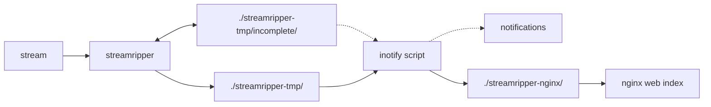

# streamripper-nginx
Streamripper rips and splits online stream,
Nginx hosts complete tracks with fancy indexing,
notify.sh messages to telegram chat and moving files.


Edit docker-compose.yml and .env and run:
```
docker-compose up --build
```
tested with Docker version 18.09.1, docker-compose version 1.21.0

## Branch lite: streamripper+nginx
you need to clean up ./streamripper-nginx/incomplete dir occasionally because
streamripper does not remove incomplete chunks.

## Branch master: streamripper+inotify+nginx
streamripper and nginx contents are in separated dirs; inotify.sh moves complete files,
overwriting or leaving files with bigger size,
cleans up /incomplete and sending notifications.


